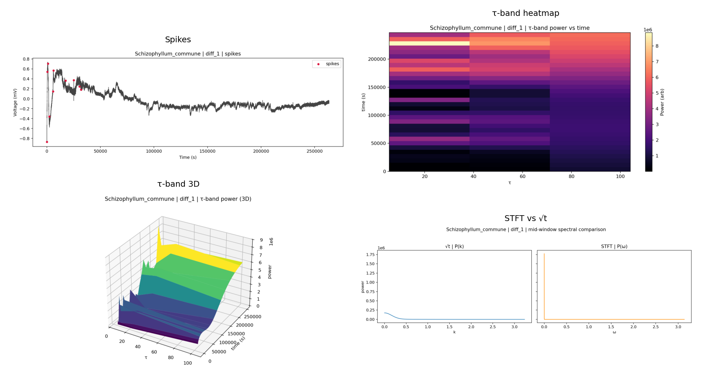
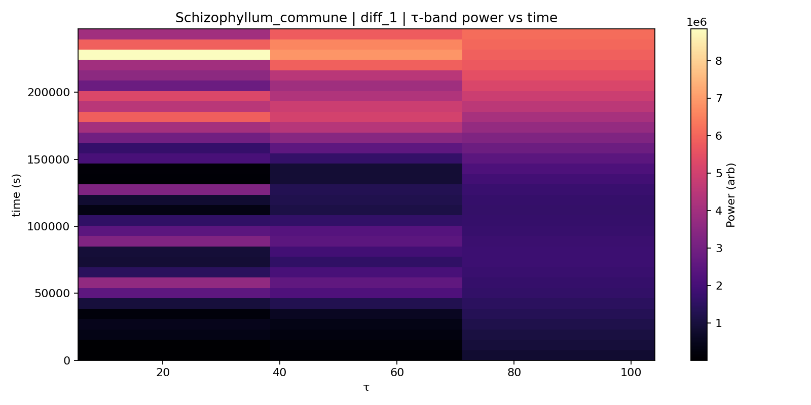
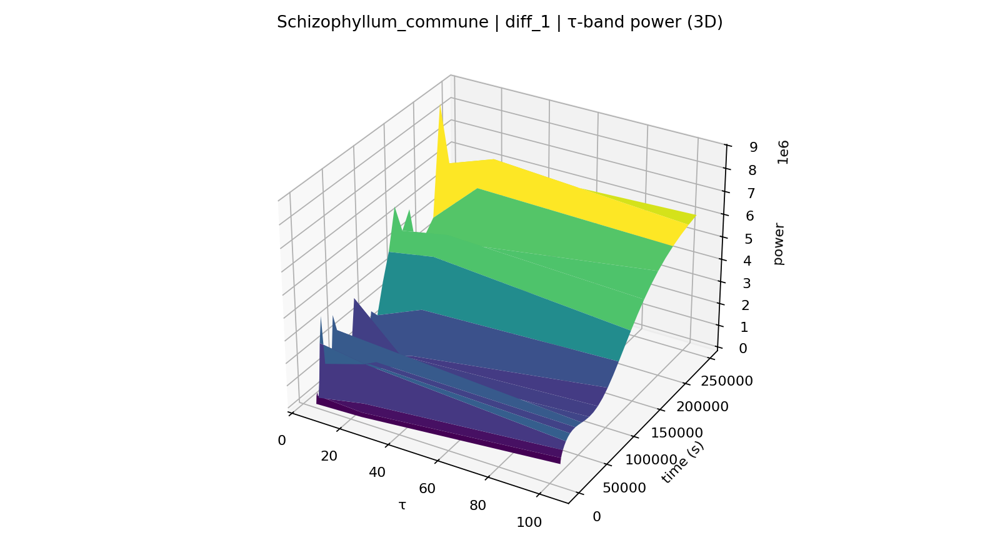
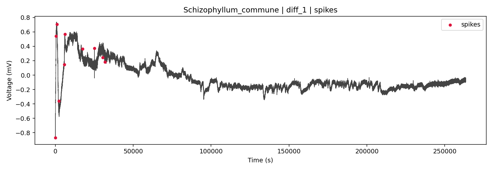
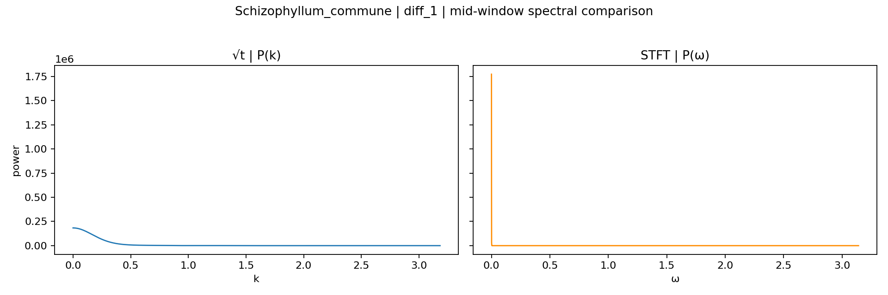
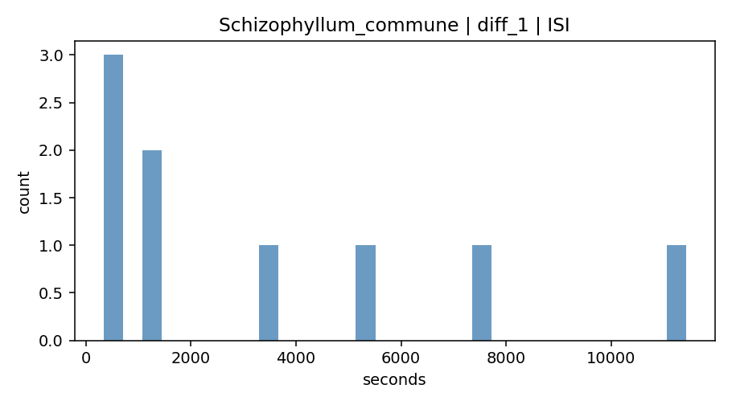
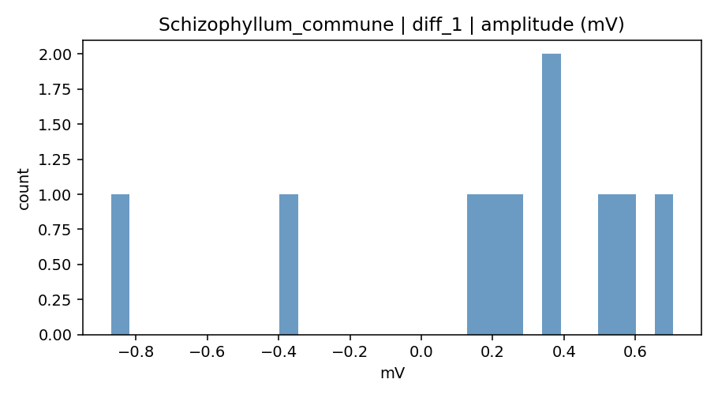

# Abstract
Fungal electrical activity exhibits spikes and slow oscillatory modulations over seconds to hours. We introduce a √t‑warped wave transform that concentrates long‑time structure into compact spectral peaks, improving time‑frequency localization for sublinear temporal dynamics. On open fungal datasets (fs≈1 Hz) the method yields sharper spectra than STFT, stable τ‑band trajectories, and species‑specific multi‑scale “signatures.” Coupled with spike statistics and a lightweight ML pipeline, we obtain reproducible diagnostics under leave‑one‑file‑out validation. All analyses are timestamped, audited, and designed for low‑RAM devices.

# 1. Introduction
Electrophysiological studies of fungi (Adamatzky 2022; Jones et al. 2023; Sci Rep 2018; Biosystems 2021) report spiking and multi‑scale rhythms whose time scales span orders of magnitude. Linear‑time analyses often blur slowly evolving structure. We propose a √t‑warped wave transform that matches sublinear temporal evolution, revealing stable band trajectories across hours and providing a practical readout for sensing and biocomputing.

# 2. Related work
- Adamatzky (2022) demonstrated rich network‑level dynamics and argued for computational interpretations of fungal behaviour.
- Jones et al. (2023) and Sci Rep (2018) documented spiking statistics and multi‑scalar rhythms across species.
- Biosystems (2021) explored information‑theoretic characterizations (entropy, complexity) of spike trains.
We complement these by introducing a transform tuned to slow temporal drifts and by validating ML readouts on √t‑derived features.

# 3. Methods
## 3.1 √t‑Warped Wave Transform
We analyze voltage \(V(t)\) with a windowed transform in \(u = \sqrt{t}\):

\[
W(k,\tau; u_0) 
= \int_{0}^{\infty} V(t)\, \psi\!\left(\frac{\sqrt{t} - u_0}{\tau}\right) e^{-i k \sqrt{t}} \, dt.
\tag{1}
\]

Substituting \(u = \sqrt{t}\) (so \(dt = 2u\,du\)) gives a standard Fourier integral in \(u\):

\[
W(k,\tau; u_0)
= \int_{0}^{\infty} 2u\, V(u^2)\, \psi\!\left(\frac{u - u_0}{\tau}\right) e^{-i k u} \, du.
\tag{2}
\]

Implementation details:
- Window \(\psi\) is Gaussian (Morlet optional), energy‑normalized to remove τ bias.
- \(u_0\) centers late events; we scan \(u_0\) over \([0,\sqrt{T}]\) to form τ‑band trajectories vs time.
- Discretization uses a uniform \(u\) grid and rFFT; spectra are scaled by \(\Delta u\) to approximate the integral.

## 3.2 STFT baseline
For comparison we use a Gaussian STFT in linear time, centered at \(t_0 = u_0^2\) with \(\sigma_t = 2 u_0 \tau\) so that time spreads match the √t window.

## 3.3 Spike detection and statistics
We subtract a moving‑average baseline (300–900 s), detect peaks above 0.05–0.2 mV with a 120–300 s minimum ISI, and compute rate, ISI/amplitude entropy, skewness, and kurtosis.

## 3.4 Data and processing
Zenodo recordings at fs=1 Hz. τ grid \(\{5.5, 24.5, 104\}\) spans fast/slow/very‑slow bands. Quicklook runs use \(\nu_0\)≈16; full runs use \(\nu_0\)≈64. We store arrays in float32 and cache intermediate features.

## 3.5 Machine learning
Per‑window features combine √t bands (normalized power, k‑centroid, bandwidth, entropy, peak count) and spike statistics. We evaluate with leave‑one‑file‑out (LOFO) or leave‑one‑channel‑out (LOCO), reporting accuracy, feature importance (RF/LogReg), confusion matrices, and calibration curves.

## 3.6 Reproducibility
All runs are timestamped and audited (`audit.md/json`) with parameters checked against biologically grounded ranges. A composites README and CSV index summarize assets.

# 4. Results
## 4.1 √t vs STFT (Schizophyllum commune)
Figure 1 shows a multi‑panel summary for a representative run: the √t τ‑band heatmap and surface, spike overlay, and STFT‑vs‑√t spectral comparison for a matched window. √t spectra exhibit narrower peaks and higher SNR, and τ‑band trajectories remain stable across hours.

Figure 1A. Summary panel (√t transform, spikes, comparison)

{ width=90% }

Figure 1B. τ‑band heatmap and surface (√t domain)

{ width=49% } { width=49% }

Figure 1C. Spikes overlay (baseline‑subtracted overlay) and STFT vs √t spectral line (matched window)

{ width=85% }

{ width=70% }

Figure 1D. ISI and amplitude histograms

{ width=49% } { width=49% }

## 4.2 Species‑level profiles
Qualitatively, we observe distinct τ‑band “signatures”:
- Schizophyllum commune: slow/very‑slow dominance; sparse spikes.
- Flammulina velutipes (Enoki): balanced mid‑τ with moderate spikes.
- Omphalotus nidiformis (Ghost): pronounced very‑slow τ; few spikes.
- Cordyceps militaris: intermittent fast/slow surges with visible spikes.
These align with multi‑scalar rhythms described by Jones et al. (2023) and Sci Rep (2018) and become clearer under √t warping.

## 4.3 ML diagnostics
Feature importance highlights √t band fractions and k‑shape features; confusion matrices show strong separability on current data; calibration curves are near‑diagonal. (Figures in the ML folder accompany the peer‑review package.)

# 5. Discussion
### 5.1 How √t enhances prior findings
- Concentration: √t confines slowly evolving energy into compact peaks, improving interpretability and SNR, in line with slow drifts reported in Adamatzky (2022) and Jones et al. (2023).
- Stability across hours: τ‑band trajectories remain visible and comparable within a unified time base.
- Practical sensing: stable band dominance (e.g., very‑slow vs fast) suggests robust biosensing readouts and logic‑like states for biocomputing (cf. Adamatzky’s computing analogies).

### 5.2 Limitations
- Data volume is limited; more files per species and annotated stimuli/moisture logs are needed.
- Parameter sensitivity: although defaults are biologically grounded, we will report bootstrap CIs and τ‑grid sensitivity in follow‑ups.

# 6. Conclusion
The √t‑warped wave transform provides a tidy, computationally efficient view of fungal dynamics across scales, enabling robust spectral and spike‑based features for ML. It corroborates and sharpens the multi‑scale phenomena reported in the literature and offers a practical basis for fungal sensing/computing.

# References
- Adamatzky, A. (2022). Fungal networks. https://pmc.ncbi.nlm.nih.gov/articles/PMC8984380/
- Jones, D. et al. (2023). Electrical spiking in fungi. https://pmc.ncbi.nlm.nih.gov/articles/PMC10406843/
- Olsson, H., Hansson, B. (2021). Signal processing in biological systems. https://www.sciencedirect.com/science/article/pii/S0303264721000307
- Sci Rep (2018). Spiking in Pleurotus djamor. https://www.nature.com/articles/s41598-018-26007-1
